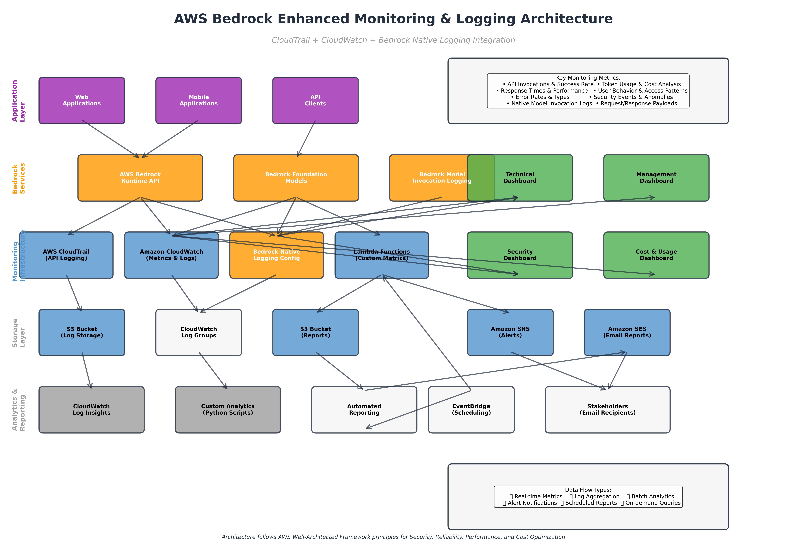
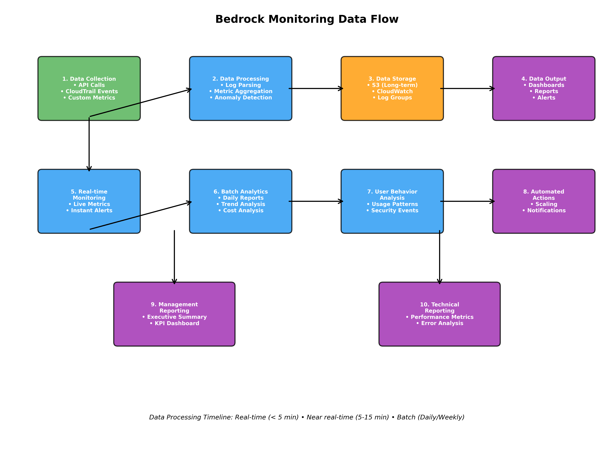

# AWS Bedrock Enhanced Monitoring & Logging Solution

[](https://aws.amazon.com/bedrock/)
[](https://aws.amazon.com/cloudformation/)
[
- `json`, `os`, `datetime`, `logging`
- `typing`, `statistics`, `collections`

**Dependency Strategy:**
- **Lambda functions**: Lightweight, built-in libraries only
- **Local scripts**: Full data science stack (pandas, matplotlib, etc.)

For complete details, see: [`docs/LAMBDA_DEPENDENCIES.md`](docs/LAMBDA_DEPENDENCIES.md)

### Step 5: Lambda Function Deploymentthon-green)](https://www.python.org/)
[](https://aws.amazon.com/cloudwatch/)
[](https://docs.aws.amazon.com/bedrock/latest/userguide/model-invocation-logging.html)

## 📋 Table of Contents

- [Overview](#overview)
- [Architecture](#architecture)
- [Enhanced Logging Features](#enhanced-logging-features)
- [Key Features](#key-features)
- [Monitoring Scope](#monitoring-scope)
- [Prerequisites](#prerequisites)
- [Quick Start](#quick-start)
- [Detailed Setup](#detailed-setup)
- [Dashboard Overview](#dashboard-overview)
- [Custom Metrics](#custom-metrics)
- [Alerting](#alerting)
- [Reporting](#reporting)
- [Security Considerations](#security-considerations)
- [Cost Optimization](#cost-optimization)
- [Troubleshooting](#troubleshooting)
- [Contributing](#contributing)
- [License](#license)

## 🎯 Overview

This enhanced monitoring solution for AWS Bedrock provides enterprise-grade observability, security auditing, and cost management capabilities with **triple-layer logging integration**. Designed following AWS Well-Architected Framework principles, it enables organizations to:

- **Monitor** Bedrock service usage patterns and performance
- **Audit** user behavior and security events with CloudTrail
- **Log** model invocations natively with Bedrock's built-in logging
- **Track** detailed metrics through CloudWatch integration  
- **Optimize** costs through detailed usage analytics
- **Alert** on anomalies and performance issues
- **Report** to stakeholders with automated insights

### 🔍 Triple-Layer Logging Architecture

This solution implements a comprehensive three-tier logging strategy:

1. **📋 CloudTrail Logging** - API-level audit trails for security and compliance
2. **📊 CloudWatch Logging** - Performance metrics and operational insights  
3. **🎯 Bedrock Native Logging** - Model invocation details with request/response payloads

### 🏗️ Solution Components

| Component | Purpose | Technology |
|-----------|---------|------------|
| **Infrastructure** | Core monitoring setup | CloudFormation |
| **Native Logging** | Bedrock model invocation logs | Bedrock Model Invocation Logging |
| **API Logging** | Security & compliance auditing | CloudTrail |
| **Operational Monitoring** | Performance & metrics | CloudWatch |
| **Dashboards** | Multi-stakeholder views | CloudWatch Dashboards |
| **Analytics** | Custom metrics & insights | Python + Lambda |
| **Alerting** | Proactive notifications | SNS + CloudWatch Alarms |
| **Reporting** | Automated documentation | Python + SES |
| **Storage** | Log retention & analysis | S3 + CloudWatch Logs |

## 🏛️ Architecture



### Architecture Layers

1. **Application Layer**: Web apps, mobile apps, and API clients
2. **Bedrock Services**: Runtime API and Foundation Models
3. **Monitoring Infrastructure**: CloudTrail, CloudWatch, Lambda functions
4. **Storage Layer**: S3 buckets and CloudWatch Log Groups
5. **Analytics & Reporting**: Custom analytics and automated reporting
6. **Dashboard Layer**: Technical, Management, Security, and Cost dashboards

### Data Flow



The solution processes data through multiple stages:
- **Real-time**: API calls, metrics, alerts (< 5 minutes)
- **Near real-time**: Log aggregation, processing (5-15 minutes)
- **Batch**: Daily/weekly reports, trend analysis

## 🔍 Enhanced Logging Features

### 🎯 Bedrock Native Model Invocation Logging

This solution includes comprehensive **Bedrock Model Invocation Logging** that captures detailed request and response data:

#### What Gets Logged:
- ✅ **Model Invocations**: Every call to Bedrock foundation models
- ✅ **Request Payloads**: Input prompts, parameters, and configurations
- ✅ **Response Payloads**: Generated text, tokens used, and metadata
- ✅ **Performance Metrics**: Latency, throughput, and processing times
- ✅ **Error Details**: Failed requests with detailed error messages
- ✅ **User Context**: Identity, session, and application information

#### Logging Destinations:
- **CloudWatch Logs**: Real-time log streaming and analysis
- **S3 Bucket**: Long-term storage and compliance archiving
- **Custom Analytics**: Python-based processing and insights

#### Key Benefits:
- 🔍 **Deep Visibility**: See exactly what prompts and responses are being processed
- 🛡️ **Security Monitoring**: Track sensitive data usage and potential leaks
- 📊 **Usage Analytics**: Understand how models are being utilized
- 💰 **Cost Attribution**: Precise token usage tracking per user/application
- 🚨 **Anomaly Detection**: Identify unusual patterns in model usage

### 📋 CloudTrail Integration

Comprehensive API-level logging for security and compliance:
- All Bedrock API calls (InvokeModel, ListFoundationModels, etc.)
- Administrative actions (CreateModel, UpdateModel, etc.)
- User authentication and authorization events
- Cross-service interactions and dependencies

### 📊 CloudWatch Metrics & Logs

Operational monitoring and performance insights:
- Real-time metrics dashboards and custom alarms
- Log aggregation from Lambda functions and applications
- Performance monitoring and threshold-based alerting
- Integration with AWS X-Ray for distributed tracing

## ✨ Key Features

### 🔍 Comprehensive Monitoring
- **API Usage Tracking**: All Bedrock API calls with detailed metrics
- **Performance Monitoring**: Response times, throughput, error rates
- **Token Usage Analytics**: Input/output token consumption by model
- **User Behavior Analysis**: Access patterns and usage trends
- **Cost Tracking**: Real-time cost estimation and optimization insights

### 🛡️ Security & Compliance
- **CloudTrail Integration**: Complete audit trail of all API activities
- **Access Monitoring**: User authentication and authorization tracking
- **Anomaly Detection**: Unusual usage patterns and security events
- **IP Address Tracking**: External access attempts and geolocation
- **Compliance Reporting**: SOC, PCI, HIPAA-ready audit logs

### 📊 Multi-Stakeholder Dashboards
- **Technical Operations**: Performance metrics, error analysis, system health
- **Management**: KPIs, trends, ROI analysis, executive summaries
- **Security**: Threat detection, access monitoring, compliance status
- **Cost Management**: Usage patterns, cost trends, optimization opportunities

### 🤖 Intelligent Alerting
- **Threshold-based Alerts**: Custom thresholds for all metrics
- **Anomaly Detection**: ML-powered unusual pattern detection
- **Escalation Policies**: Multi-tier notification system
- **Alert Correlation**: Intelligent grouping of related events

## 🎯 Monitoring Scope

### Management Perspective KPIs
- **Business Metrics**
  - Daily/Monthly Active Users
  - API Usage Growth Rate
  - Cost per Transaction
  - Revenue Attribution
  - User Adoption Rates

- **Operational Metrics**
  - Service Availability (99.9% SLA)
  - Mean Time to Resolution (MTTR)
  - Customer Satisfaction Score
  - Operational Cost Efficiency

### Technical Perspective KPIs
- **Performance Metrics**
  - API Response Times (p50, p95, p99)
  - Throughput (requests/second)
  - Error Rates by Type
  - Model-specific Performance

- **Infrastructure Metrics**
  - Lambda Function Performance
  - CloudWatch Log Ingestion Rates
  - S3 Storage Utilization
  - Network Latency

- **Security Metrics**
  - Failed Authentication Attempts
  - Unusual Access Patterns
  - Data Exfiltration Indicators
  - Compliance Violations

## 📋 Prerequisites

### AWS Requirements
- AWS CLI configured with appropriate credentials
- AWS Account with Bedrock service enabled
- IAM permissions for CloudFormation, CloudWatch, CloudTrail, S3, Lambda, SNS, SES
- Verified email address for SES (for reporting)

### Technical Requirements
- Python 3.10 or higher
- Git
- Bash shell (for deployment scripts)
- jq (JSON processor)

### Minimum IAM Permissions
```json
{
  "Version": "2012-10-17",
  "Statement": [
    {
      "Effect": "Allow",
      "Action": [
        "cloudformation:*",
        "cloudwatch:*",
        "logs:*",
        "cloudtrail:*",
        "s3:*",
        "lambda:*",
        "sns:*",
        "ses:*",
        "iam:CreateRole",
        "iam:AttachRolePolicy",
        "iam:PassRole",
        "bedrock:*"
      ],
      "Resource": "*"
    }
  ]
}
```

## 🚀 Quick Start

### 1. Clone Repository
```bash
git clone <repository-url>
cd bedrock-monitoring
```

### 2. Configure Parameters
```bash
# Edit parameters file
vim cloudformation/parameters.json

# Update with your settings:
{
  "Environment": "prod",
  "AlertEmail": "your-email@company.com",
  "CloudTrailRetentionDays": "90",
  "CloudWatchLogRetentionDays": "30"
}
```

### 3. Deploy Infrastructure
```bash
cd cloudformation
chmod +x deploy.sh
./deploy.sh deploy
```

### 4. Access Dashboards
The deployment will output dashboard URLs. Access them from the AWS CloudWatch console.

## 🔧 Detailed Setup

### Step 1: Infrastructure Deployment

#### Deploy Core Infrastructure
```bash
# Deploy infrastructure stack
aws cloudformation deploy \
  --template-file cloudformation/bedrock-monitoring-infrastructure.yaml \
  --stack-name bedrock-monitoring-infrastructure \
  --parameter-overrides file://cloudformation/parameters.json \
  --capabilities CAPABILITY_IAM CAPABILITY_NAMED_IAM \
  --region us-east-1
```

#### Deploy Dashboards
```bash
# Deploy dashboard stack
aws cloudformation deploy \
  --template-file cloudformation/bedrock-monitoring-dashboards.yaml \
  --stack-name bedrock-monitoring-dashboards \
  --parameter-overrides Environment=prod \
  --region us-east-1
```

### Step 2: Enable Bedrock Native Logging

#### Automatic Enablement via CloudFormation
The infrastructure deployment automatically configures:
- Bedrock Model Invocation Logging Configuration
- CloudWatch Log Group for Bedrock logs
- S3 bucket for long-term log storage
- IAM roles with necessary permissions

#### Manual Verification & Configuration
```bash
cd python-scripts
python enable_bedrock_logging.py --enable
```

This script will:
- ✅ Verify Bedrock logging configuration
- ✅ Enable model invocation logging if not already active
- ✅ Configure log destinations (CloudWatch + S3)
- ✅ Test logging functionality

### Step 3: Python Environment Setup

#### Install Dependencies
```bash
cd python-scripts
pip install -r requirements.txt
```

#### Configure Environment Variables
```bash
export AWS_REGION=us-east-1
export ENVIRONMENT=prod
export SNS_TOPIC_ARN=arn:aws:sns:us-east-1:123456789012:bedrock-monitoring-alerts-prod
export REPORT_BUCKET=bedrock-monitoring-reports-prod
export SENDER_EMAIL=noreply@yourcompany.com
```

### Step 3: Lambda Function Deployment

#### Package and Deploy Custom Metrics Lambda
```bash
# Create deployment package
zip -r bedrock-monitor.zip bedrock_monitor.py

# Update Lambda function
aws lambda update-function-code \
  --function-name bedrock-custom-metrics-prod \
  --zip-file fileb://bedrock-monitor.zip
```

## 📊 Dashboard Overview

### 1. Technical Operations Dashboard
**Purpose**: Real-time monitoring for DevOps and SRE teams

**Key Widgets**:
- API Calls Overview (Success/Error/Throttle rates)
- Response Time Metrics (Average, Maximum, p95)
- Token Usage Trends
- Model Usage Distribution
- Error Analysis and Recent Error Logs
- System Resource Usage
- Monitoring Function Health

**Use Cases**:
- Incident response and troubleshooting
- Performance optimization
- Capacity planning
- SLA monitoring

### 2. Management Dashboard  
**Purpose**: Executive-level insights and KPIs

**Key Widgets**:
- Daily API Usage Trends
- Daily Token Consumption
- Success Rate Percentage
- Total Daily Invocations/Errors
- Hourly Usage by Model
- Average Response Time vs SLA
- Top 10 Users by Usage

**Use Cases**:
- Business performance tracking
- ROI analysis
- Strategic planning
- Resource allocation decisions

### 3. Security Monitoring Dashboard
**Purpose**: Security threat detection and compliance

**Key Widgets**:
- External IP Access Attempts
- Failed Authentication Attempts
- User Activity Timeline
- Unusual User Agents
- Security-Related Errors
- Most Active IPs
- Model Management Activities

**Use Cases**:
- Security incident investigation
- Compliance auditing
- Threat detection
- Access pattern analysis

### 4. Cost and Usage Dashboard
**Purpose**: Financial optimization and usage analysis

**Key Widgets**:
- Daily Token Usage Trends
- Token Distribution by Model
- Token Usage by User and Model
- Monthly Token Summaries
- Cost Estimation Metrics

**Use Cases**:
- Cost optimization
- Budget planning
- Usage forecasting
- Chargeback allocation

## 📈 Custom Metrics

The solution collects and publishes custom metrics to provide deeper insights:

### Available Custom Metrics

| Metric Name | Description | Unit | Dimensions |
|-------------|-------------|------|------------|
| `Custom/Bedrock/TokensPerRequest` | Average tokens per API request | Count | Environment, ModelId |
| `Custom/Bedrock/CostPerRequest` | Estimated cost per API request | None | Environment, ModelId |
| `Custom/Bedrock/UniqueUsers` | Number of unique users per hour | Count | Environment |
| `Custom/Bedrock/ModelSwitchRate` | Rate of model switching by users | Percent | Environment |
| `Custom/Bedrock/AnomalyScore` | Anomaly detection score | None | Environment, MetricType |

### Metric Collection Process

```python
# Example usage of BedrockMonitor
from bedrock_monitor import BedrockMonitor

monitor = BedrockMonitor(region_name='us-east-1')

# Collect usage metrics
metrics = monitor.collect_usage_metrics(start_time, end_time)

# Detect anomalies
anomalies = monitor.detect_anomalies(threshold_multiplier=2.0)

# Publish custom metrics
monitor.publish_custom_metrics(metrics)
```

## 🚨 Alerting

### Alert Types

#### 1. Performance Alerts
- **High Error Rate**: > 5% error rate sustained for 10 minutes
- **High Latency**: Average response time > 30 seconds
- **Low Success Rate**: < 95% success rate
- **High Token Usage**: Token usage exceeds 150% of baseline

#### 2. Security Alerts
- **Unusual Access Patterns**: Access from new geographical locations
- **Failed Authentication Spike**: > 10 failed attempts in 5 minutes
- **Suspicious User Agents**: Non-standard or potentially malicious user agents
- **Model Management Changes**: Unauthorized model modifications

#### 3. Cost Alerts
- **Budget Threshold**: Monthly costs exceed 80% of budget
- **Usage Spike**: Token usage exceeds 200% of daily average
- **Unexpected Model Usage**: Usage of expensive models without approval

#### 4. Operational Alerts
- **Service Unavailability**: Bedrock API returning 5xx errors
- **Monitoring Function Errors**: Custom monitoring Lambda failures
- **Log Ingestion Issues**: CloudWatch Logs ingestion failures

### Alert Configuration

```bash
# Example: Create custom alert
aws cloudwatch put-metric-alarm \
  --alarm-name "Bedrock-Token-Usage-Spike" \
  --alarm-description "Alert when token usage spikes" \
  --metric-name "InputTokens" \
  --namespace "AWS/Bedrock" \
  --statistic "Sum" \
  --period 300 \
  --threshold 10000 \
  --comparison-operator "GreaterThanThreshold" \
  --evaluation-periods 2 \
  --alarm-actions "arn:aws:sns:us-east-1:123456789012:bedrock-alerts"
```

## 📄 Reporting

### Automated Report Types

#### 1. Executive Summary Report
**Frequency**: Weekly
**Recipients**: C-level executives, business stakeholders
**Content**:
- High-level KPIs and trends
- ROI analysis
- Strategic recommendations
- Budget and cost analysis

#### 2. Technical Performance Report
**Frequency**: Daily
**Recipients**: DevOps, SRE, Engineering teams
**Content**:
- Detailed performance metrics
- Error analysis and root cause
- Capacity utilization
- Performance optimization recommendations

#### 3. Security Audit Report
**Frequency**: Weekly
**Recipients**: Security team, compliance officers
**Content**:
- Security events summary
- Access pattern analysis
- Compliance status
- Risk assessment

#### 4. Cost Optimization Report
**Frequency**: Monthly
**Recipients**: Finance, engineering managers
**Content**:
- Detailed cost breakdown
- Usage efficiency analysis
- Optimization opportunities
- Budget vs actual comparison

### Report Generation

```python
# Example: Generate technical report
from bedrock_reporter import BedrockReporter

reporter = BedrockReporter(region_name='us-east-1')

# Generate weekly technical report
technical_report = reporter.create_technical_report(days_back=7)

# Send to stakeholders
recipients = ['devops@company.com', 'sre@company.com']
reporter.send_report(technical_report, recipients, "Weekly Bedrock Technical Report")

# Save to S3
reporter.save_report_to_s3(technical_report, "weekly-technical-report")
```

## 🔒 Security Considerations

### Data Protection
- **Encryption at Rest**: All S3 buckets use AES-256 encryption
- **Encryption in Transit**: All data transfer uses TLS 1.2+
- **Access Control**: IAM roles with least privilege principles
- **Log Retention**: Configurable retention periods for compliance

### Privacy and Compliance
- **PII Handling**: No PII is logged or stored
- **Data Residency**: All data remains in specified AWS region
- **Audit Trail**: Complete CloudTrail logging for compliance
- **Access Logging**: All dashboard and report access is logged

### Security Best Practices Implemented
- **VPC Integration**: Optional VPC deployment for network isolation
- **Resource-based Policies**: Fine-grained access control
- **CloudFormation Drift Detection**: Infrastructure integrity monitoring
- **Secret Management**: AWS Secrets Manager for sensitive data

## 💰 Cost Optimization

### Cost Structure

#### Monthly Cost Estimate (for typical usage)
| Service | Usage | Cost |
|---------|--------|------|
| CloudWatch Logs | 100GB ingested | $50 |
| CloudWatch Metrics | 1000 custom metrics | $30 |
| CloudWatch Dashboards | 4 dashboards | $12 |
| CloudTrail | Data events enabled | $20 |
| Lambda | 100,000 executions | $20 |
| S3 Storage | 500GB (logs + reports) | $12 |
| SNS | 1000 notifications | $2 |
| **Total Estimated** | | **$146/month** |

### Cost Optimization Strategies

#### 1. Log Retention Optimization
```yaml
# Adjust retention periods based on compliance requirements
CloudWatchLogRetentionDays: 30  # Reduce for cost savings
CloudTrailRetentionDays: 90     # Increase for compliance
```

#### 2. Metric Filtering
```python
# Filter high-volume metrics to reduce costs
def should_publish_metric(metric_name, value):
    # Only publish non-zero metrics
    if value == 0:
        return False
    # Skip frequent low-value metrics
    if metric_name == 'low_priority_metric' and value < threshold:
        return False
    return True
```

#### 3. Storage Lifecycle Management
```yaml
# Automatically transition old data to cheaper storage
LifecycleConfiguration:
  Rules:
    - Status: Enabled
      Transitions:
        - Days: 30
          StorageClass: STANDARD_IA
        - Days: 90
          StorageClass: GLACIER
```

## 🔧 Troubleshooting

### Common Issues and Solutions

#### 1. CloudFormation Deployment Failures

**Issue**: Stack deployment fails with IAM permissions error
```
The role defined for the function cannot be assumed by Lambda
```

**Solution**:
```bash
# Verify IAM permissions
aws sts get-caller-identity

# Check CloudFormation events
aws cloudformation describe-stack-events --stack-name bedrock-monitoring-infrastructure
```

#### 2. Lambda Function Errors

**Issue**: Custom metrics Lambda function timing out
```
Task timed out after 300.00 seconds
```

**Solution**:
```yaml
# Increase timeout in CloudFormation template
Timeout: 900  # 15 minutes

# Or reduce data processing scope
def collect_metrics(hours_back=1):  # Reduce from 24 to 1 hour
```

#### 3. Dashboard Data Not Showing

**Issue**: Dashboard widgets showing "No data available"

**Solution**:
```bash
# Verify CloudWatch metrics exist
aws cloudwatch list-metrics --namespace AWS/Bedrock

# Check log group permissions
aws logs describe-log-groups --log-group-name-prefix /aws/bedrock
```

#### 4. High CloudWatch Costs

**Issue**: Unexpected high CloudWatch bills

**Solution**:
```python
# Implement metric sampling
import random

def should_publish_sample(sample_rate=0.1):
    return random.random() < sample_rate

# Use in metric publishing
if should_publish_sample():
    publish_metric(metric_name, value)
```

### Debug Mode

Enable debug logging for troubleshooting:

```python
import logging
logging.basicConfig(level=logging.DEBUG)

# Run monitoring with verbose output
monitor = BedrockMonitor()
monitor.collect_usage_metrics(start_time, end_time)
```

### Health Checks

Monitor solution health with these commands:

```bash
# Check CloudFormation stack status
aws cloudformation describe-stacks --stack-name bedrock-monitoring-infrastructure

# Verify Lambda function health
aws lambda invoke --function-name bedrock-custom-metrics-prod response.json

# Check recent CloudWatch metrics
aws cloudwatch get-metric-statistics \
  --namespace Custom/Bedrock \
  --metric-name TokensPerRequest \
  --start-time $(date -u -d '1 hour ago' +%Y-%m-%dT%H:%M:%S) \
  --end-time $(date -u +%Y-%m-%dT%H:%M:%S) \
  --period 300 \
  --statistics Average
```

## 🤝 Contributing

We welcome contributions to improve this monitoring solution!

### Development Setup
```bash
# Clone repository
git clone <repository-url>
cd bedrock-monitoring

# Set up Python environment
python -m venv venv
source venv/bin/activate  # On Windows: venv\Scripts\activate
pip install -r python-scripts/requirements.txt

# Install development dependencies
pip install pytest black flake8 moto
```

### Running Tests
```bash
# Run unit tests
cd python-scripts
python -m pytest tests/

# Run linting
black *.py
flake8 *.py
```

### Contribution Guidelines
1. Fork the repository
2. Create a feature branch (`git checkout -b feature/amazing-feature`)
3. Make your changes
4. Add tests for new functionality
5. Ensure all tests pass
6. Commit changes (`git commit -m 'Add amazing feature'`)
7. Push to branch (`git push origin feature/amazing-feature`)
8. Open a Pull Request

### Code Standards
- Follow PEP 8 for Python code
- Use CloudFormation best practices for infrastructure
- Include comprehensive error handling
- Add logging for debugging
- Update documentation for new features

## 📝 License

This project is licensed under the MIT License - see the [LICENSE](LICENSE) file for details.

## 🆘 Support

### Documentation
- [AWS Bedrock Documentation](https://docs.aws.amazon.com/bedrock/)
- [CloudWatch User Guide](https://docs.aws.amazon.com/cloudwatch/)
- [CloudFormation User Guide](https://docs.aws.amazon.com/cloudformation/)

### Community Support
- [AWS Forums](https://forums.aws.amazon.com/)
- [Stack Overflow](https://stackoverflow.com/questions/tagged/aws-bedrock)
- [GitHub Issues](../../issues)

### Professional Support
For enterprise support and customization services, contact your AWS Solutions Architect or partner.

---

## 📊 Appendix

### A. CloudWatch Metrics Reference

#### AWS/Bedrock Namespace Metrics
| Metric | Description | Unit | Dimensions |
|--------|-------------|------|------------|
| Invocations | Number of API calls | Count | ModelId |
| Errors | Number of failed API calls | Count | ModelId, ErrorType |
| Duration | Response time | Milliseconds | ModelId |
| InputTokens | Input tokens processed | Count | ModelId |
| OutputTokens | Output tokens generated | Count | ModelId |
| Throttles | Number of throttled requests | Count | ModelId |

### B. Log Group Structure

```
/aws/bedrock/
├── application-logs/{environment}/
│   ├── api-calls
│   ├── model-invocations
│   └── user-sessions
├── cloudtrail-logs/{environment}/
│   ├── data-events
│   └── management-events
├── model-invocations/{environment}/
│   ├── request-logs
│   ├── response-logs
│   └── error-logs
└── security-events/{environment}/
    ├── authentication
    ├── authorization
    └── access-patterns
```

### C. Environment Variables Reference

| Variable | Description | Default | Required |
|----------|-------------|---------|-----------|
| AWS_REGION | AWS region for deployment | us-east-1 | Yes |
| ENVIRONMENT | Environment name (dev/staging/prod) | prod | Yes |
| SNS_TOPIC_ARN | SNS topic for alerts | - | Yes |
| REPORT_BUCKET | S3 bucket for reports | - | No |
| SENDER_EMAIL | Verified SES email for reports | - | No |
| TECH_TEAM_EMAILS | Comma-separated email list | - | No |
| ENABLE_DEBUG_LOGGING | Enable verbose logging | false | No |

### D. API Reference

#### BedrockMonitor Class Methods

```python
class BedrockMonitor:
    def __init__(self, region_name: str = 'us-east-1')
    def get_available_models(self) -> List[Dict[str, Any]]
    def collect_usage_metrics(self, start_time: datetime, end_time: datetime) -> Dict[str, Any]
    def analyze_user_behavior(self, hours_back: int = 24) -> Dict[str, Any]
    def detect_anomalies(self, threshold_multiplier: float = 2.0) -> List[Dict[str, Any]]
    def generate_cost_analysis(self, days_back: int = 30) -> Dict[str, Any]
    def send_alert(self, message: str, subject: str = "Bedrock Monitoring Alert") -> bool
    def publish_custom_metrics(self, metrics: Dict[str, Any]) -> bool
```

---

**🎉 Congratulations! You now have a comprehensive AWS Bedrock monitoring solution that provides enterprise-grade observability, security auditing, and cost management capabilities.**

For the latest updates and additional resources, visit our [GitHub repository](../../) and star ⭐ the project if you find it useful!